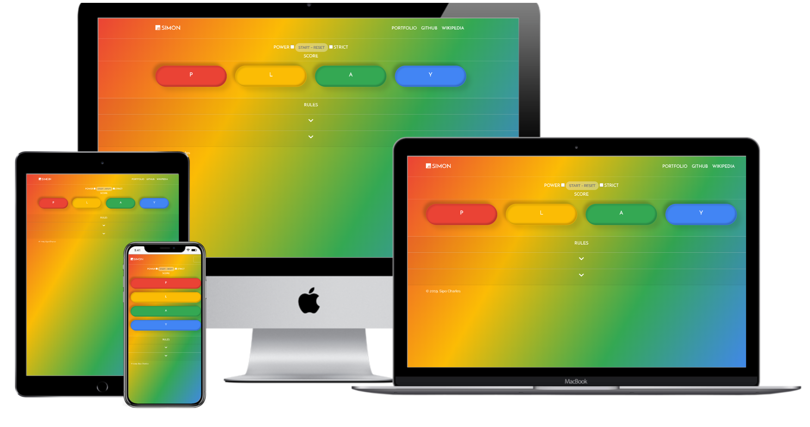

<h1 align="center">
 
  
   
     
  JavaScript - Simon
   
</h1>

<h3 align="center">Interactive Front End Development</h3>

## Memory Game

A Memory Game Which Requires a Player to Replicate a Continually Growing Sequence of Signals

## Functionality

- A random series of synchronised sound & light buttons get presented to the user.

- The user is required to input a sequence of synchronised audio & light buttons correctly which can be done by either pressing the according button with a cursor on laptop/desktop devices, a finger/thumb on smaller devices or by pressing an individual letter on a keyboard which corresponds to a specific illuminated synchronised audio & light button. Additionally, upon valid input by the user, the same series of synchronised sound & bright buttons is replayed but with an additional step.

- Users will hear a sound that corresponds to an individual button whenever a pattern of synchronised audio & light controls play.

- If a user inputs the wrong pattern field, a notification by a specific sound accompanied with a text message will appear in the 'score tracker' display, after which point the series of synchronised audio & light buttons will play again to remind the user the of sequence so they may try again.

- The user can see how many steps are in the current sequence of synchronised audio & light buttons to be selected.

- If a user wants to restart the game, they can select a button which grants this action; thus, returning the app to a single step.

- The user has the option of playing in both 'Strict' mode which restarts the game whenever an incorrect field gets chosen or 'Normal' mode which only repeats the pattern subsequent of the wrong button getting pressed.

- The user can win the game by achieving a total of 10 correct steps, after which point the game app will salute them with a congratulations message in acknowledgement of their triumph and ends.